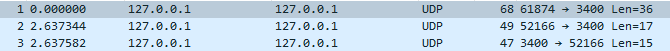
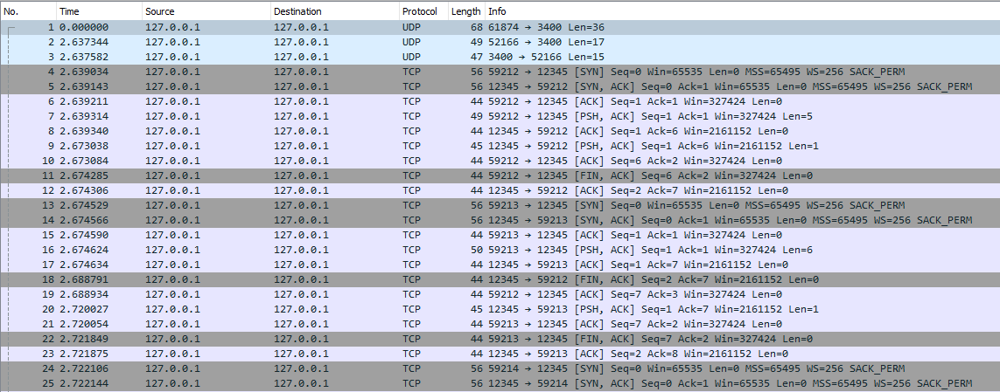
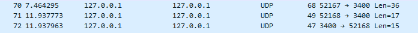
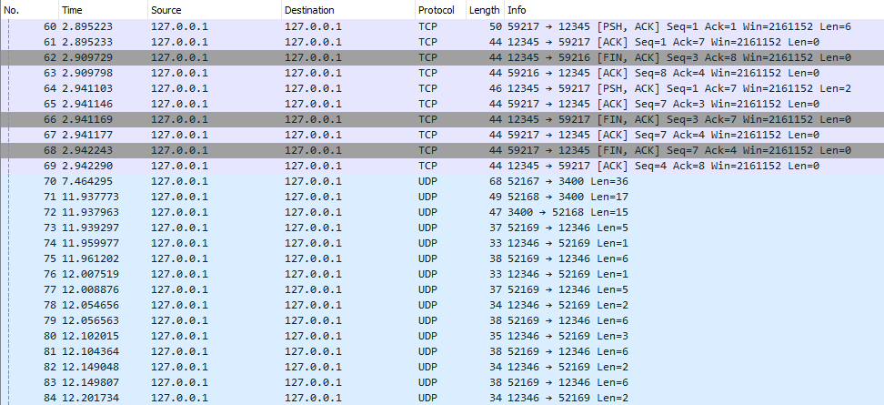
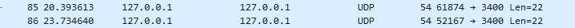

**Para ver, além das capturas no Wireshark, capturas do projeto em execução, acesse o relatório.**

Nos primeiros pacotes da captura, é possível observar o servidor enviando a mensagem para o DNS e, quando solicitado, o DNS manda mensagem para o cliente informando o host e a porta do serviço.

  

Nos pacotes seguintes, é possível observar o Three-way Handshake para as conexões TCP, a partir das flags [SYN], [SYN ACK], [ACK] e a finalização da conexão com [FIN, ACK] [ACK] ao acabar de mandar a mensagem. Em seguida, outra conexão é aberta e assim por diante até enviar todas as mensagens.

  

Em seguida, a conexão cliente-servidor UDP se inicia. É possível observar, novamente, a mensagem do servidor enviada para o DNS e a consequente resposta do DNS para o cliente informando o host e a porta nos pacotes 70, 71 e 72. 

  

Por fim, ocorre o envio dos pacotes UDP até que todas as solicitações sejam atendidas.

  

Encerrando os dois servidores (TCP e UDP) com o comando ‘Ctrl + C’, é possível observar a sinalização de remoção para o DNS nos dois últimos pacotes.

  

